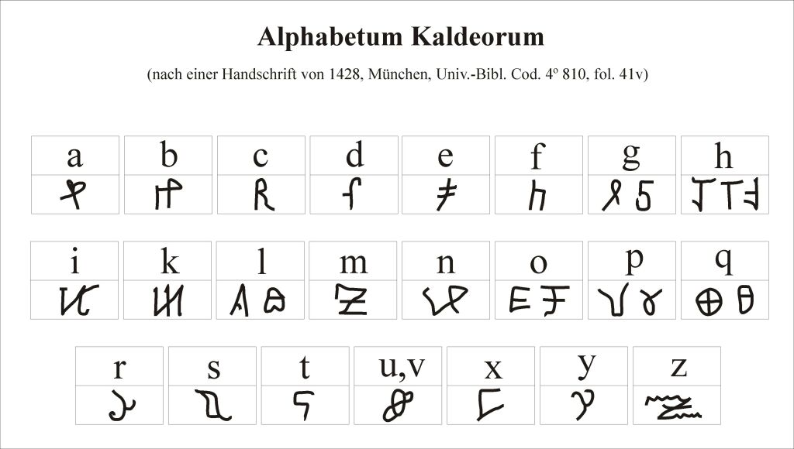

% IT - Security / Kryptographie
% HackerSchool
% 2020


# Was machen wir heute?

1. Wir lernen, was IT Sicherheit, Kryptographie, Kryptologie, Steganographie, ... ist.
2. Wir programmieren uns ein Verschlüsselungsprogramm
3. Wir schreiben uns ein Programm zum Knacken dieser Geheimschrift
4. Wir überlegen uns, wie man den Geheimcode besser machen kann 


# Was ist Sicherheit?

Sicherheit bezeichnet allgemein den Zustand, der für Individuen, Gemeinschaften
sowie andere Lebewesen, Objekte und Systeme **frei von unvertretbaren Risiken** ist
oder als **gefahrenfrei** angesehen wird.

Für Individuen und Gemeinschaften bezeichnet Sicherheit den Zustand des
**Nicht-bedroht-Seins** der *Freiheit* ihrer *ungestörten* Eigenentwicklung in zweierlei
Hinsicht:

- im Sinne des tatsächlichen (objektiven) **Nichtvorhandenseins von Gefährdung** –
    als Sicherheit im objektiven Sinne, sowie 

- im Sinne der Abwesenheit von (subjektiver) **Furcht vor Gefährdung** – als
    Sicherheit im subjektiven Sinne.

Quelle: [Wikipadia](https://de.wikipedia.org/w/index.php?title=Sicherheit&oldid=200680002)
    

# Was ist IT Sicherheit?

IT Sicherheit verfolgt diese Ziele:

- **Vertraulichkeit:** Niemand und Nichts unsere Daten mitlesen.
- **Integrität:** Die Daten dürfen nicht durch jemanden oder etwas verändert werden.
- **Verfügbarkeit:** Ich muss an die Daten ran kommen, wenn ich sie brauche.

Manchmal kommt hinzu:

- **Authentizität:** Die Nachricht kommt wirklich von demjenigen, der es behauptet.
- **Anonymität:** Niemand weiß, wer auf der anderen Seite sitzt. 


# Was ist Steganographie?

Bei der Steganographie geht es darum, den Geheimtext nicht zu verschlüsseln,
sondern zu verstecken z.B. mittels... 

- Geheimtinte
- zusammen mit einer sichtbaren Nachricht
- durch Codewörtern in einem Text
- oder versteckt in Dateien


# Steganographie-Beispiel

- Das Foto von der HackerSchool Webseite

{ height=30% }

- Das Foto mit einer versteckten Nachricht darin

{ height=30% }

https://stylesuxx.github.io/steganography/


# Geheimschriften



Quelle: [Wikimedia Commons Alphabetum Kaldeorum](https://commons.wikimedia.org/w/index.php?title=Category:Alphabetum_Kaldeorum&oldid=336789896&uselang=de)


# Was ist Kryptologie?

Kryptologie sind Kryptographie und Kryptoanalyse sowie einiges, was damit zu tun hat.

## Kryptographie

Kryptographie ist die Wissenschaft, die sich um die Entwicklung von Geheimschriften kümmert.

## Kryptoanalyse

Die Kryptoanalyse behandelt die Frage, wie man Geheimschriften knacken kann. 

# Caesar-Verschlüsselung

Jeder Buchstabe im Alphabet wird durch einen anderen ersetzt.

{ height=40% }

Zum Download und selbst basteln: <https://shop.mathematikum.de/media/image/thumbnail/caesar-bastelbogen_720x600.jpg>


# repl.it

https://repl.it/

1. "Python" auswählen


# Aufgabe 1: Caesaren-Verschlüsselung

Wir programmieren uns eine Caesaren-Verschlüsselung.

Die Ausgabe könnte so aussehen:

```
demoklar =  HACKERSCHOOL  s =  4
demochiffre =  LEGOIVWGLSSP
entschluesselt =  HACKERSCHOOL
```

- Wir wollen das Wort "HACKERSCHOOL" verschlüsseln.
- Jeder Buchstabe wird um 4 Stellen verschoben (H -> L, A -> E, ...).
- Zum Entschlüsseln muss man die Buchstaben jeweils um 4 Stellen zurück drehen.

Vorsicht: Wenn man mit einem Index in Listen oder Zeichenketten arbeitet, darf
man nicht über das letzte Zeichen hinaus.


# Beispiellösung

``` {.python}
def caesar(klartext, schluessel):
  chiffre = ""
  alphabet = "ABCDEFGHIJKLMNOPQRSTUVWXYZ"
  alphabet += alphabet
  for i in range(len(klartext)):
    buchstabe = klartext[i]
    stelle = alphabet.index(buchstabe)
    chiffre += alphabet[stelle+schluessel]  
  return chiffre

demoklar = "HACKERSCHOOL"
s = 4
demochiffre = caesar(demoklar, s)
print("demochiffre = ", demochiffre)
entschluesselt = caesar(demochiffre, -s)
print("entschluesselt = ", entschluesselt)
```

# Aufgabe 2: Caesaren-Code "knacken"

Egal, ob per Hand oder mit einem Computer. Es gibt nur 26 Möglichkeiten, wie die
Scheibe eingestellt werden kann. Mit dem Computer lassen sich leicht alle
Möglichkeiten durchprobieren.

```
('i = ', 0, ' :', 'LEGOIVWGLSSP')
('i = ', 1, ' :', 'KDFNHUVFKRRO')
('i = ', 2, ' :', 'JCEMGTUEJQQN')
('i = ', 3, ' :', 'IBDLFSTDIPPM')
('i = ', 4, ' :', 'HACKERSCHOOL')
...
```

Wenn man alle Möglichkeiten durchprobiert, um sein Ziel zu erreichen, spricht
man von "Brute-Force-Angriffen", was soviel heißt, wie "mit roher Gewalt".

# Wer findet den Klartext zu

1. QYLXUMFCYMNBUNAYQIHHYH
2. ZAYADQEQODQFE
3. SXTAPTCVTTXCTHITMITHXHITVPA

# Beispiellösung

``` {.python}
def caesar(text, schluessel):
    chiffre = ""
    alphabet = "ABCDEFGHIJKLMNOPQRSTUVWXYZ"
    alphabet += alphabet
    for i in range(len(text)):
        buchstabe = klartext[i]
        stelle = alphabet.index(buchstabe)
        chiffre += alphabet[stelle+schluessel]  
    return chiffre

demochiffre = "LEGOIVWGLSSP"
for i in range(27):
    print("i = ", i, " :", caesar(demochiffre, -i))
```

# ROT13: Caesar Spezialfall

Im Internet wird noch immer gerne ROT13, als "Pseudoverschlüsselung" benutzt.
Die Idee: Man soll den Text nicht sofort lesen können, aber jeder weiß, wie es
sich entschlüsseln lässt.

- Prinzip: Caesaeren-Verschlüsselung 
- Schlüssel ist immer 13, weil dann Ver- und Entschlüsselung gleich sind.
  - 26 Buchstaben = 2x13 Buchstaben verschieben
- Beispiele
  - Geocaching: https://coord.info/GC595CB
  - Witze

Was macht ein Ostfriese mit einem Messer in der Hand auf dem Deich?
Re jvyy va Frr fgrpura!

Webseiten zum "entschlüsseln": <https://multidec.web-lab.at/rot.php> 


# ROT13 Code in Python

``` {.python}
rot13trans = str.maketrans(
  'ABCDEFGHIJKLMNOPQRSTUVWXYZabcdefghijklmnopqrstuvwxyz', 
  'NOPQRSTUVWXYZABCDEFGHIJKLMnopqrstuvwxyzabcdefghijklm')

# Function to translate plain text
def rot13(text):
   return text.translate(rot13trans)
def main():
   txt = "ROT13 Algorithm"
   print(rot13(txt))
	
if __name__ == "__main__":
   main()
```

Quelle: [Cryptography with Python - ROT13 Algorithm](https://www.tutorialspoint.com/cryptography_with_python/cryptography_with_python_rot13_algorithm.htm) (auf Python3 portiert)

# Monoalphabetische Ersetzung (1/2)

`monoalpjabeticCypher.py`:

```{.python}
from string import ascii_letters, digits
from random import shuffle

def random_monoalpha_cipher(pool=None):
    if pool is None:
        pool = ascii_letters + digits
    original_pool = list(pool)
    shuffled_pool = list(pool)
    shuffle(shuffled_pool)
    return dict(zip(original_pool, shuffled_pool))

def inverse_monoalpha_cipher(monoalpha_cipher):
    inverse_monoalpha = {}
    for key, value in monoalpha_cipher.items():
        inverse_monoalpha[value] = key
    return inverse_monoalpha
```

# Monoalphabetische Ersetzung (2/2)

```{.python}

def encrypt_with_monoalpha(message, monoalpha_cipher):
    encrypted_message = []
    for letter in message:
        encrypted_message.append(
            monoalpha_cipher.get(letter, letter))
    return ''.join(encrypted_message)

def decrypt_with_monoalpha(encrypted_message, 
        monoalpha_cipher):
    return encrypt_with_monoalpha(
        encrypted_message, 
        inverse_monoalpha_cipher(monoalpha_cipher))
```

Quelle: [Hacking Monoalphabetic Cipher](https://www.tutorialspoint.com/cryptography_with_python/cryptography_with_python_hacking_monoalphabetic_cipher.htm)

# Verwendung von Monoalphabetic 

`main.py`:

```{.python}
import monoalphabeticCipher as mc

cipher = mc.random_monoalpha_cipher()
print(cipher)
encrypted = mc.encrypt_with_monoalpha(
    'Hello all you hackers out there!', cipher)
decrypted = mc.decrypt_with_monoalpha(
    encrypted, cipher)

print(encrypted)
print(decrypted)
```

# Wie häufig kommt welches Zeichen vor?

```{.python}
from string import ascii_uppercase

class Counter(dict):
    def __missing__(self, key):
        return 0

stat = Counter()
cipher = "oXN 9kG XytGx6h4XGGXht sGt e4t"
for i in cipher:
    stat[i] += 1
sorted_stat = sorted(stat.items(), key=lambda x: x[1], 
    reverse=True)
print(sorted_stat)
```

# Und in der Deutschen Sprache?

Die Analyse von `oXN 9kG XytGx6h4XGGXht sGt e4t`

```
[('G', 5), ('X', 4), (' ', 4), ('t', 4), ('h', 2), 
 ('4', 2), ('o', 1), ('N', 1), ('9', 1), ('k', 1), 
 ('y', 1), ('x', 1), ('6', 1), ('s', 1), ('e', 1)]
```

1. E: 17,40% -> G, X oder t
2. N: 9,78% -> G, X oder t
3. I: 7,55% -> G, X oder t
4. S: 7,27% -> h, 4
5. R: 7,00% -> h, 4
6. A: 6,51% -> h, 4

Einfach nachschlagen unter: <https://de.wikipedia.org/wiki/Buchstabenh%C3%A4ufigkeit>


# Base64 Encoding

Base64 ist keine Verschlüsselung im klassischen Sinne. Es wird dafür verwendet,
binäre Dateien (mit unsichtbaren Zeichen etc.) in ausschließlich lesbare Zeichen
zu verwandeln und anders herum.

```{.python}
from base64 import standard_b64encode, standard_b64decode

enc = standard_b64encode("Dies ist eine Base64 Demo.")
dec = standard_b64decode(enc)

print(enc)
print(dec)
```

Damit werden z.B. Bilder etc. in E-Mails verschickt. 

# Python Crypto-Bibliothek


# Public-Key Kryptographie


# Beispielcode für Public-Key


# Challanges

Für die folgenden Beispiele finde heraus:

- Was ist das für eine Verschlüsselung? (1 Punkt)
- Wie könnte man sie knacken? (2 Punkte)
- Wie lautet die Klartextnachricht? (6 Punkte)

Aufgaben auf `Kryptographie-Aufgaben.pdf`.

